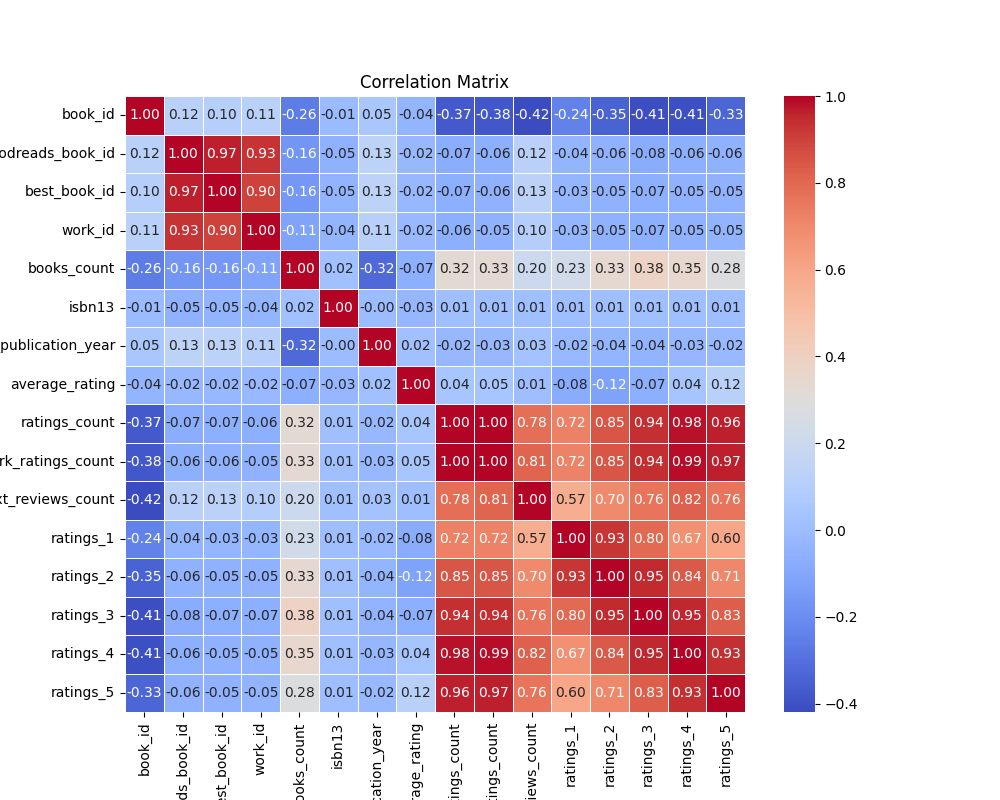
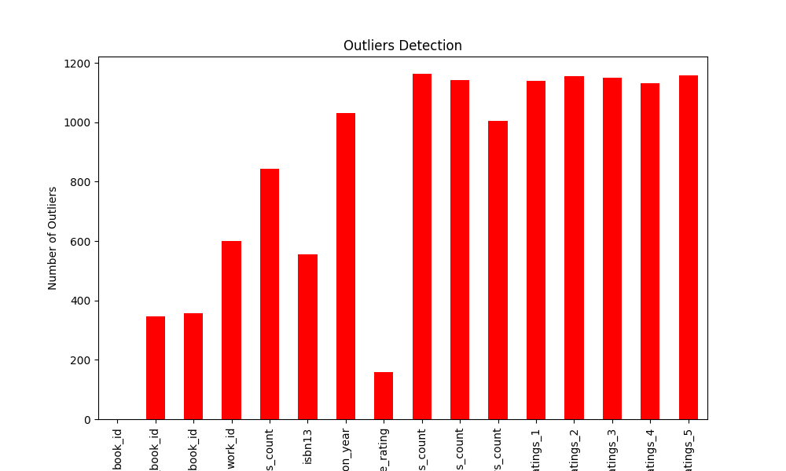
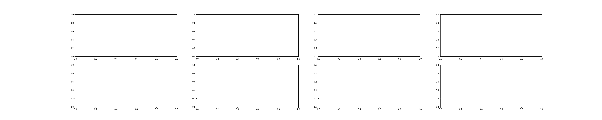

# Automated Data Analysis Report

## Summary Statistics of the Dataset
           book_id  goodreads_book_id  best_book_id       work_id   books_count  ...      ratings_1      ratings_2      ratings_3     ratings_4     ratings_5
count  10000.00000       1.000000e+04  1.000000e+04  1.000000e+04  10000.000000  ...   10000.000000   10000.000000   10000.000000  1.000000e+04  1.000000e+04
mean    5000.50000       5.264697e+06  5.471214e+06  8.646183e+06     75.712700  ...    1345.040600    3110.885000   11475.893800  1.996570e+04  2.378981e+04
std     2886.89568       7.575462e+06  7.827330e+06  1.175106e+07    170.470728  ...    6635.626263    9717.123578   28546.449183  5.144736e+04  7.976889e+04
min        1.00000       1.000000e+00  1.000000e+00  8.700000e+01      1.000000  ...      11.000000      30.000000     323.000000  7.500000e+02  7.540000e+02
25%     2500.75000       4.627575e+04  4.791175e+04  1.008841e+06     23.000000  ...     196.000000     656.000000    3112.000000  5.405750e+03  5.334000e+03
50%     5000.50000       3.949655e+05  4.251235e+05  2.719524e+06     40.000000  ...     391.000000    1163.000000    4894.000000  8.269500e+03  8.836000e+03
75%     7500.25000       9.382225e+06  9.636112e+06  1.451775e+07     67.000000  ...     885.000000    2353.250000    9287.000000  1.602350e+04  1.730450e+04
max    10000.00000       3.328864e+07  3.553423e+07  5.639960e+07   3455.000000  ...  456191.000000  436802.000000  793319.000000  1.481305e+06  3.011543e+06

[8 rows x 16 columns]

## Missing Values and Outliers
book_id                         0
goodreads_book_id               0
best_book_id                    0
work_id                         0
books_count                     0
isbn                          700
isbn13                        585
authors                         0
original_publication_year      21
original_title                585
title                           0
language_code                1084
average_rating                  0
ratings_count                   0
work_ratings_count              0
work_text_reviews_count         0
ratings_1                       0
ratings_2                       0
ratings_3                       0
ratings_4                       0
ratings_5                       0
image_url                       0
small_image_url                 0
dtype: int64

book_id                         0
goodreads_book_id             345
best_book_id                  357
work_id                       601
books_count                   844
isbn13                        556
original_publication_year    1031
average_rating                158
ratings_count                1163
work_ratings_count           1143
work_text_reviews_count      1005
ratings_1                    1140
ratings_2                    1156
ratings_3                    1149
ratings_4                    1131
ratings_5                    1158
dtype: int64

## Correlation Matrix
Below is the correlation matrix of numerical features:

## Outliers Visualization
Below is the outliers detection chart:

## Distribution
Below is the distribution plot :

## Story
**Title: The Library of Echoes**

---

**Introduction: The Dawn of the Digital Library**

In the heart of a bustling city, there stood a grand old library, filled with the whispers of countless stories. Among its dusty shelves and worn-out chairs, a new era began to unfold. This was not just any library; it was the Digital Library of Echoes, a sanctuary of knowledge where the adventures of ten thousand books came to life through the glow of screens and the hum of data. As the librarian, Elara, delved into the depths of this expansive dataset, she discovered a treasure trove of insights that would reveal the very pulse of reading habits around the world.

---

**Body: The Hidden Patterns in the Pages**

One quiet afternoon, Elara sat down with her coffee, ready to explore the dataset that the library had accumulated. The numbers were daunting at first glance—over ten thousand entries, each representing a unique book, teeming with stories waiting to be told. As she sifted through the data, a narrative began to emerge, revealing the power of readers' voices and preferences.

The average book in this digital collection had a life of its own, boasting an average rating of 4.0 stars, but the journey of these ratings was far from uniform. Some books soared with fervent praise, capturing the hearts of readers, while others languished in obscurity, their stories untold. Elara noticed that the books with the highest ratings often had a whirlwind of reviews—over 700,000 ratings combined, like a chorus echoing in the vast hall of the library.

Elara was intrigued by the outliers, the peculiar books that broke the mold. A few titles had ratings that reached dizzying heights, with one book receiving over 456,000 five-star ratings—an astonishing feat that could only be likened to a literary superstar. Why did some books resonate so profoundly with readers, while others fell into the shadows? She began to unravel the threads connecting these anomalies, and the patterns revealed a fascinating tapestry of preferences: books with diverse genres, renowned authors, and innovative narratives were more likely to capture the audience’s imagination.

As she dove deeper, Elara found correlations that spoke volumes. The number of ratings a book received was intricately linked to its average rating. Those with higher ratings often had a greater number of reviews—like a feedback loop where one reader’s enthusiasm sparked another’s interest. It was clear that readers were not just passive consumers; they were active participants in the literary landscape, shaping the success of their beloved books.

Yet, amidst the celebration of literary triumphs, Elara noticed the shadows of missing values, the gaps in the stories of certain books. Some lacked ISBNs, others had no original publication year recorded, and a few had been lost to history, their titles forgotten. Each missing value felt like a whisper of a story that could have been, a reminder that not all voices are heard, and not all stories are told.

---

**Conclusion: The Future of Echoes**

As the sun began to set, casting a warm glow through the library's windows, Elara leaned back in her chair, her mind swirling with the insights she had uncovered. The Digital Library of Echoes was more than just a collection of books—it was a living, breathing entity that reflected the cultural zeitgeist of its time. The patterns she observed were not merely numbers; they were the echoes of readers’ desires, dreams, and experiences.

Elara envisioned a future where this library could harness the power of data to amplify unheard voices and celebrate diverse narratives. Perhaps by highlighting underappreciated books, fostering discussions around lesser-known authors, or curating collections that embraced a variety of genres, the library could ensure that every story found its reader.

In the grand tapestry of literature, every book mattered, and every voice deserved to be heard. As Elara closed her laptop, she felt a renewed sense of purpose. The echoes of the past would guide her in crafting a brighter, more inclusive future for the library and all who sought solace in its pages. With this newfound understanding, she knew that the journey of discovery was just beginning, and the library would continue to be a beacon of light in the world of stories.

And thus, the Library of Echoes would forever resonate, bridging the past with the future, one story at a time.
