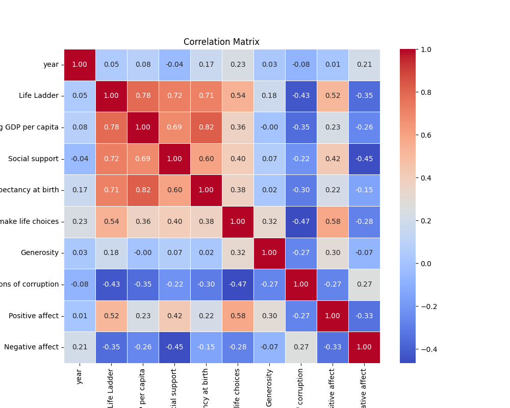
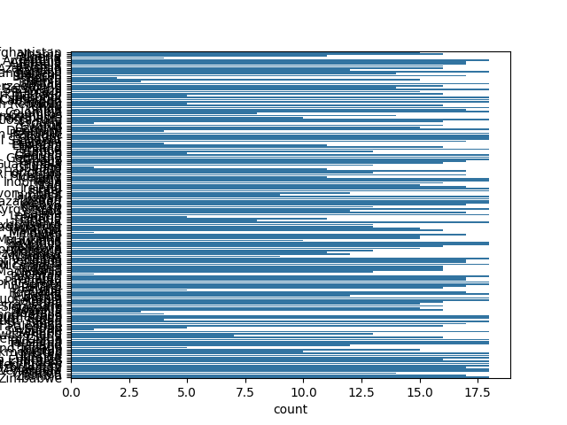

# Automated Data Analysis Report

## Summary Statistics of the Dataset
```shell              year  Life Ladder  Log GDP per capita  Social support  ...   Generosity  Perceptions of corruption  Positive affect  Negative affect
count  2363.000000  2363.000000         2335.000000     2350.000000  ...  2282.000000                2238.000000      2339.000000      2347.000000
mean   2014.763860     5.483566            9.399671        0.809369  ...     0.000098                   0.743971         0.651882         0.273151
std       5.059436     1.125522            1.152069        0.121212  ...     0.161388                   0.184865         0.106240         0.087131
min    2005.000000     1.281000            5.527000        0.228000  ...    -0.340000                   0.035000         0.179000         0.083000
25%    2011.000000     4.647000            8.506500        0.744000  ...    -0.112000                   0.687000         0.572000         0.209000
50%    2015.000000     5.449000            9.503000        0.834500  ...    -0.022000                   0.798500         0.663000         0.262000
75%    2019.000000     6.323500           10.392500        0.904000  ...     0.093750                   0.867750         0.737000         0.326000
max    2023.000000     8.019000           11.676000        0.987000  ...     0.700000                   0.983000         0.884000         0.705000

[8 rows x 10 columns]

```
## Categorical variables
```shell       Country name
count          2363
unique          165
top       Argentina
freq             18

```
## Missing Values and Outliers
```shellCountry name                          0
year                                  0
Life Ladder                           0
Log GDP per capita                   28
Social support                       13
Healthy life expectancy at birth     63
Freedom to make life choices         36
Generosity                           81
Perceptions of corruption           125
Positive affect                      24
Negative affect                      16
dtype: int64

```
## Outliers
```shellyear                                  0
Life Ladder                           2
Log GDP per capita                    1
Social support                       48
Healthy life expectancy at birth     20
Freedom to make life choices         16
Generosity                           39
Perceptions of corruption           194
Positive affect                       9
Negative affect                      31
dtype: int64

```
## Correlation Matrix
Below is the correlation matrix of numerical features:



## Outliers Visualization
Below is the outliers detection chart:


## Distribution
Below is the distribution plot :


## Story
### The Tapestry of Happiness: A Journey Through Data

In a world where numbers often swirl like leaves in the wind, there exists a profound narrative woven through the threads of data—an intricate tapestry that tells the stories of human happiness across the globe. The stage is set in a digital realm where the echoes of laughter, tears, and dreams are captured in numbers, offering a glimpse into the lives of 165 countries, spanning nearly two decades. This is the story of the Life Ladder—a measure of happiness that transcends mere statistics.

#### The Prelude: An Invitation to Explore

As the curtain rises, we find ourselves in the year 2005, a time when the global landscape was marked by uncertainty and hope. The Life Ladder, an abstract concept made tangible through data, beckons us to explore its peaks and valleys. Each rung represents a nation's collective joy, shaped by myriad factors including economic prosperity, social support, and the elusive feeling of freedom to make choices. This journey is not just about numbers; it is a quest to understand what makes life worth living.

#### The Heart of the Story: Patterns Unveiled

As we delve deeper, we uncover the summary statistics—a treasure trove of insights. The mean Life Ladder score hovers around 5.48, a gentle reminder that while many find joy in their daily lives, a significant portion still grapples with discontent. The highest score, an 8.02, shines like a beacon of hope, illuminating the path for others to follow. But what shapes this happiness? 

Through the lens of correlation, we begin to see connections emerge. The Log GDP per capita reveals a striking relationship with the Life Ladder—higher economic prosperity often leads to greater happiness. Yet, as we sift through the data, we encounter a more complex tale. Social support, a pillar of community strength, tightly intertwines with happiness, suggesting that the bonds between individuals may be just as essential as wealth. 

However, not all is well in this garden of joy. The specter of corruption casts a long shadow, revealing an inverse relationship with happiness. As perceptions of corruption rise, happiness tends to dwindle, suggesting a world where trust is paramount. The data reveals that a mere perception can ripple through societies, affecting not just policies, but the very fabric of life.

#### The Characters: Real Lives Behind the Data

To breathe life into these numbers, we meet Emma from Argentina, who embodies the duality of this narrative. With a Life Ladder score that fluctuates with her country’s economic ups and downs, she navigates her dreams with the support of a tight-knit community. Her story intertwines with that of Malik from Norway, whose high score reflects a life rich in social equity and well-being. As we follow their paths, we witness how Emma's hopes rise and fall with her country's fortunes, while Malik thrives, buoyed by a robust safety net. 

In the quieter corners of our tapestry, we find stories of struggle—of those who feel the weight of negative affect pressing down like a storm cloud. The data reveals that while positive emotions can lift spirits, negative feelings linger, casting shadows on the brightest days. 

#### The Conclusion: Reflections and Implications

As we step back to admire the completed tapestry, the interconnectedness of these stories becomes clear. The Life Ladder is not merely a score; it is a reflection of the human experience, a canvas painted with the hues of joy, sorrow, and resilience. 

The implications of this analysis resonate beyond the numbers. They challenge governments and communities to foster environments where happiness can flourish—through economic stability, social support, and the fostering of trust. The journey through this data unveils the profound truth that happiness is a shared endeavor, a collective climb towards a brighter future.

As the curtain falls, we are left with lingering questions: How can we bridge the gaps in happiness across societies? What steps can be taken to uplift those at the lower rungs of the Life Ladder? In this tale of data and discovery, the journey is never truly over, encouraging us to continue seeking the elusive yet essential goal of human happiness.
