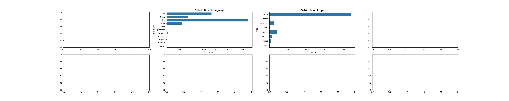

# Automated Data Analysis Report

## Summary Statistics of the Dataset
```shell           overall      quality  repeatability
count  2652.000000  2652.000000    2652.000000
mean      3.047511     3.209276       1.494721
std       0.762180     0.796743       0.598289
min       1.000000     1.000000       1.000000
25%       3.000000     3.000000       1.000000
50%       3.000000     3.000000       1.000000
75%       3.000000     4.000000       2.000000
max       5.000000     5.000000       3.000000

```
## Categorical variables
```shell             date language   type              title                 by
count        2553     2652   2652               2652               2390
unique       2055       11      8               2312               1528
top     21-May-06  English  movie  Kanda Naal Mudhal  Kiefer Sutherland
freq            8     1306   2211                  9                 48

```
## Missing Values and Outliers
```shelldate              99
language           0
type               0
title              0
by               262
overall            0
quality            0
repeatability      0
dtype: int64

```
## Outliers
```shelloverall          1216
quality            24
repeatability       0
dtype: int64

```
## Correlation Matrix
Below is the correlation matrix of numerical features:


## Outliers Visualization
Below is the outliers detection chart:


## Distribution
Below is the distribution plot :


## Story
### The Chronicles of Cinema: A Data-Driven Odyssey

#### Prologue: A Flicker of Lights

In a world where stories breathe life into our imaginations, cinema stands as a grand tapestry woven from threads of creativity, humanity, and technology. Each film, a portal into another realm, allows us to step into shoes we may never wear, feel emotions we may never experience, and journey through narratives that captivate and inspire. Yet behind the silver screen, a wealth of data pulses quietly, waiting to be uncovered. This is a tale of discovery, a journey through numbers and statistics that reveal the heartbeats of filmmaking—quality, repeatability, and the enigmatic allure of cinema.

#### Chapter One: The Gathering of the Data

Our story begins with a dataset—a collection of 2,652 cinematic creations, each waiting to be analyzed. As we delve into the stats, we discover that the average film in this collection has a quality rating of about 3.2, a figure that suggests a solid, if not spectacular, cinematic experience. The repeatability score, hovering around 1.5, indicates that while some films are memorable enough to watch again, many are not destined to become classics. 

We see a spectrum of experiences, from the lowest quality of 1 to the shimmering heights of 5. The average film’s quality reveals a broad middle ground, suggesting that while many films are competent, only a select few transcend into the realm of unforgettable. It’s a reminder that even in a sea of mediocrity, gems can still shine.

#### Chapter Two: The Story Behind the Numbers

As we explore further, the categorical statistics paint a vivid picture of the cinematic landscape. Films span a variety of genres, languages, and origins, with the most frequent title, *Kanda Naal Mudhal*, echoing as a popular choice among viewers. The narrative unfolds with a certain rhythm; English films dominate the landscape, accounting for over half of the dataset. 

Yet, the outliers tell their own story. With a staggering 1,216 films rated as outliers in overall quality, it becomes evident that the cinematic experience is a rollercoaster—some films soar while others plummet. These extremes suggest a passionate divide among viewers; the eclectic tastes of 2,652 individuals manifest in dramatic highs and lows. A film that is a masterpiece for one could be a misstep for another, a testament to the subjective nature of art.

#### Chapter Three: The Web of Connections

As we delve deeper into the correlation matrix, we find intriguing relationships between the film's overall quality, its specific quality, and its repeatability. A robust correlation of 0.83 between overall quality and specific quality suggests a strong likelihood that if a film feels good, it is indeed good. However, the moderate correlation with repeatability, at 0.51, hints at an underlying truth: even quality films may not beckon viewers back for a second viewing—a fleeting enchantment rather than a lasting spell.

This revelation invites reflection. What makes a film memorable? Is it the storytelling, the characters, or perhaps the emotions it evokes? The data suggests a complexity that transcends mere numbers; it urges us to consider the artistry behind these creations.

#### Epilogue: Reflections on the Silver Screen

As our journey through the world of cinema data comes to a close, we are left with a tapestry rich in stories and insights. The numbers, often perceived as cold and lifeless, pulse with the warmth of human experience. Each film is not just a number in a database; it is a collection of dreams, ambitions, and narratives that connect us all.

The implications of this analysis are profound. For filmmakers, understanding these patterns can guide future creations. For audiences, it highlights the diverse landscape of cinematic experiences—reminding us that every film has the potential to resonate in unexpected ways. As we leave the theater of data, we carry with us a deeper appreciation for the art of storytelling, both on-screen and off.

And so, as the credits roll on our exploration, we are left pondering the next cinematic adventure that awaits us, a world where data meets imagination, and every watch is a chance to uncover something new.
